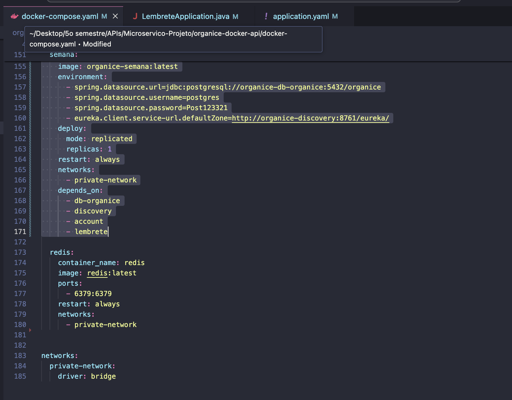
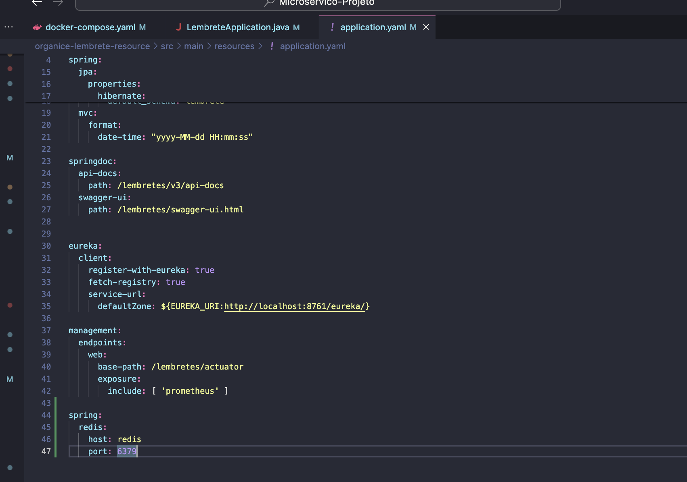
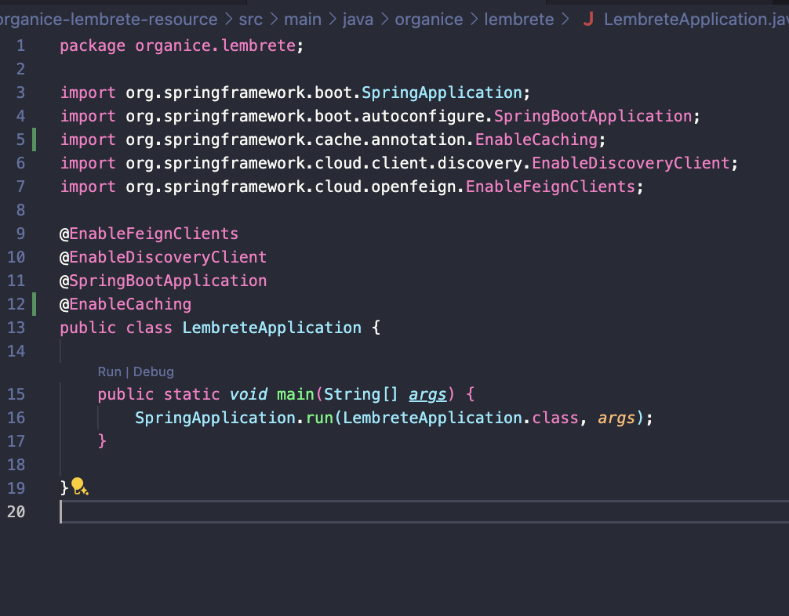
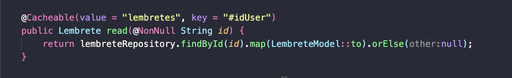

# organice.redis

## PEDRO PERTUSI 

# Spring Redis Lembrete Project

Este projeto Spring Boot demonstra o uso do Redis como cache para otimizar a recuperação de dados em uma aplicação de lembretes. A seguir, são apresentadas as configurações e o uso específico do Redis no contexto de lembretes.

### Docker Compose

A imagem abaixo mostra a configuração do Docker Compose que inclui o serviço Redis junto com outros serviços necessários para o projeto.

### Configuração do Spring Boot

A configuração do Spring Boot inclui a definição do Redis como o servidor de cache. Abaixo está a seção relevante do arquivo `application.yaml`:

### Implementação da Aplicação

A classe principal da aplicação Spring Boot habilita o caching e define os clientes necessários para descoberta de serviços e comunicação entre microserviços.

## Caching com Redis

O Redis é usado para cachear os resultados da rota de lembretes para melhorar o desempenho da aplicação. Abaixo está um exemplo de como os lembretes são cacheados usando anotações do Spring:

